```mermaid
graph TD
    A[Browser Request] --> B[Initial Bundle 6.09MB]

    B --> C[Angular Core 400KB]
    B --> D[Spartacus Core 2.1MB]
    B --> E[Spartacus Storefront 1.4MB]
    B --> F[All Styles 1.2MB]
    B --> G[App Code 200KB]

    D --> D1[Auth Services]
    D --> D2[CMS Registry]
    D --> D3[OCC Client]
    D --> D4[State Management]
    D --> D5[User Services]

    E --> E1[Layout Components]
    E --> E2[Navigation]
    E --> E3[Header/Footer]
    E --> E4[Product Listing]

    F --> F1[ASM Styles ❌]
    F --> F2[Cart Styles ❌]
    F --> F3[Checkout Styles ❌]
    F --> F4[Order Styles ❌]
    F --> F5[User Styles ❌]

    H[Route Change] --> I{Feature Needed?}
    I -->|Order| J[Load spartacus-order 667KB]
    I -->|Checkout| K[Load spartacus-checkout 318KB]
    I -->|ASM| L[Load spartacus-asm 268KB]
    I -->|Saved Cart| M[Load spartacus-saved-cart 143KB]

    N[CMS Content] --> O{Component Type}
    O -->|Registered| P[Use Cached Component]
    O -->|Not Found| Q[Log Warning & Skip]

    style B fill:#ff6b6b,stroke:#000,stroke-width:3px
    style D fill:#ffd93d,stroke:#000,stroke-width:2px
    style E fill:#ffd93d,stroke:#000,stroke-width:2px
    style F fill:#ff6b6b,stroke:#000,stroke-width:2px
    style J fill:#51cf66,stroke:#000,stroke-width:2px
    style K fill:#51cf66,stroke:#000,stroke-width:2px
    style L fill:#51cf66,stroke:#000,stroke-width:2px
    style M fill:#51cf66,stroke:#000,stroke-width:2px

    classDef eager fill:#ff6b6b,stroke:#000,stroke-width:2px
    classDef lazy fill:#51cf66,stroke:#000,stroke-width:2px
    classDef core fill:#ffd93d,stroke:#000,stroke-width:2px
```

# Spartacus Loading Architecture Diagram

## Legend:

- 🔴 **Red (Eager)**: Loaded immediately on page load
- 🟡 **Yellow (Core)**: Essential services that must load early
- 🟢 **Green (Lazy)**: Properly lazy-loaded on demand

## Key Insights:

### ❌ **Problems** (Red - Eager Loading):

1. **Initial Bundle Size**: 6.09MB is too large for initial load
2. **All Styles**: Every feature's CSS loads upfront (1.2MB)
3. **Core Services**: Large service layer loads immediately

### ✅ **Working Well** (Green - Lazy Loading):

1. **Feature Modules**: Order, Checkout, ASM load only when needed
2. **Route-based Splitting**: Components load per route
3. **Dynamic Imports**: Proper `import()` statements in feature configs

### 🟡 **Necessary Evil** (Yellow - Core):

1. **Authentication**: Required for route guards
2. **CMS Registry**: Needed for server-side rendering
3. **State Management**: NgRx store setup
4. **Layout System**: Essential UI framework

## Architecture Flow:

1. **Initial Load**: Core + Storefront + Styles (6MB)
2. **Route Navigation**: Triggers lazy chunk loading
3. **CMS Rendering**: Uses pre-registered components
4. **User Interaction**: May trigger additional feature loads
